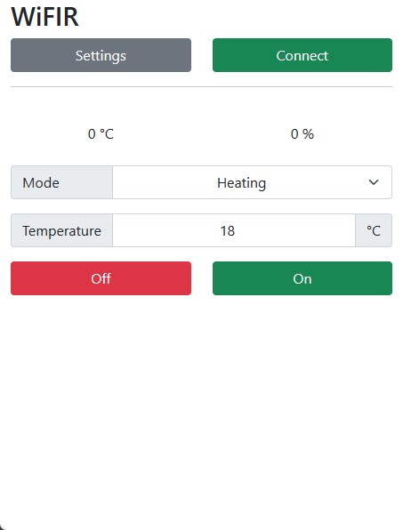

# WiFIR PWA

This is an installable PWA to control my [WiFIR](https://github.com/Duckle29/wifir) project.  

Using mqtt.js it connects over websockets to an mqtt broker and subscribes to the sensor topics, while being able to push to the set-state topic.

This provides basic control of a heatpump remotely.

 